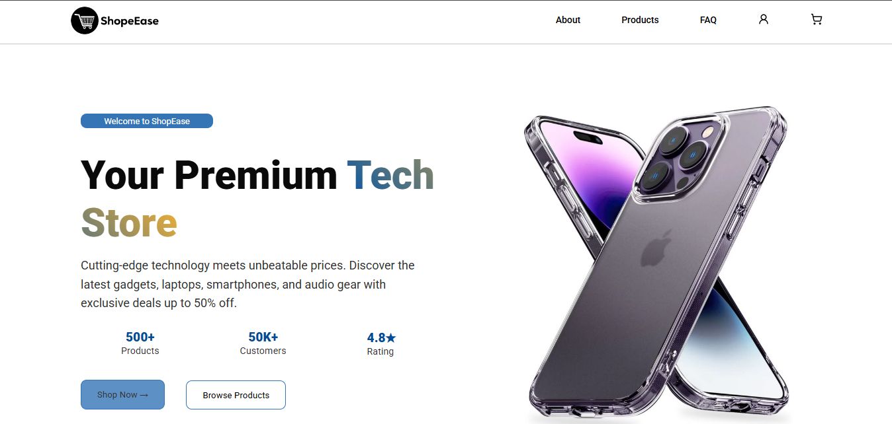
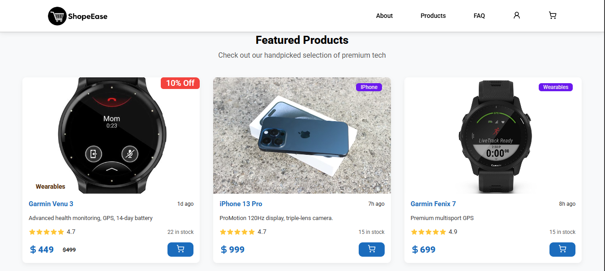
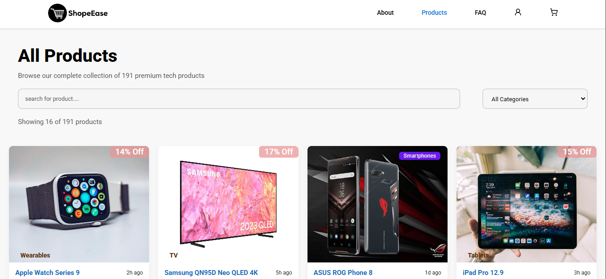

# ShopEase

A clean, modern, and user-friendly e-commerce web application that allows users to browse products, view details, and place orders with a smooth and intuitive interface.

![ShopEase Banner]

---

## 🚀 Features

* **Product Browsing** – Explore a wide range of products displayed in a clean grid layout.
* **Product Details** – View images, descriptions, and pricing for each item.
* **Multiple Orders** – Users can order as many products as they want.
* **Responsive Design** – Works smoothly on both mobile and desktop.
* **Clean UI/UX** – Minimal, modern design.

---

## 🛠️ Tech Stack

* **Frontend:** HTML, CSS, JavaScript
* **Build Tool:** Vite
* **Mock Backend:** JSON Server (for API simulation)
* **Tools:** Git, GitHub, VS Code

---

## 📁 Project Structure

```
shopeease/
│
├── public/                 # Static assets

├── src/                    # App source code
├── index.html              # Main HTML file
├── package.json            # Dependencies
├── vite.config.js          # Vite config
└── README.md
```

---

## ⚙️ Getting Started

### 1️⃣ Clone the repository

```bash
git clone https://github.com/your-username/shopeease.git
```

### 2️⃣ Install dependencies

```bash
npm install
```

### 3️⃣ Start JSON Server

```bash
json-server --watch data/db.json --port 4000 --delay 500
```

### 4️⃣ Run the development server

```bash
npm run dev
```

---

## 📸 Screenshots

Adding screenshots helps make your project more engaging.

### ⭐ Featured Product Section



### 🛒 Product List



### 📄 Product Details


---

## 🤝 Contributing

Contributions, issues, and feature requests are welcome.

---

## 📝 License

This project is licensed under the **MIT License**.

---

Made with  by **Kumneger Getiye**
